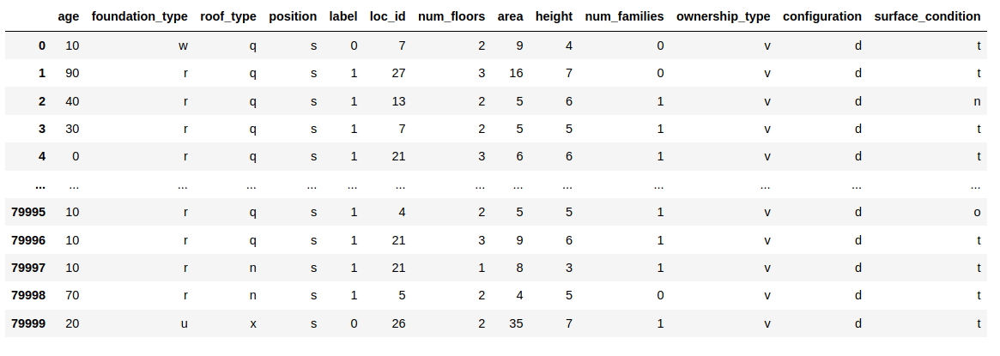

# Earthquake destruction prediction

## The data

The dataset mainly consists of information on the buildings' structure and 
their legal ownership. Each row in the dataset represents a specific building 
in the region that was hit by earthquake. Here is a snapshot:

The data is stored in a csv file `data/train.csv` 

## Process
The Random Forest algorithm. The \_\_init__ function of 
RandomForestClassifier which works without giving any parameters.
